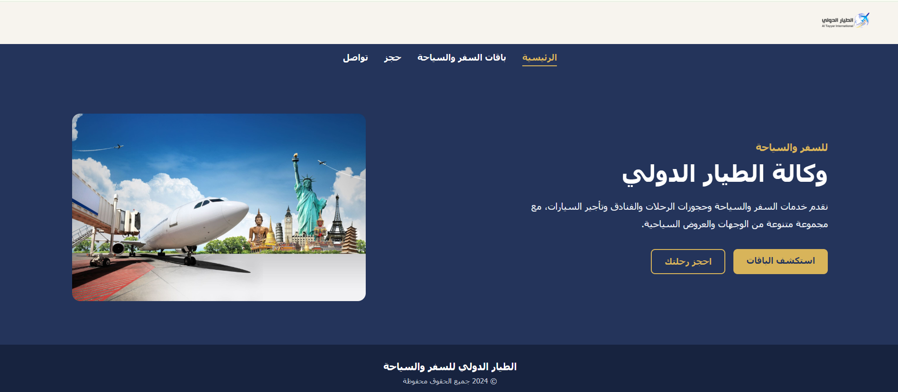

# Al-Tayaar International Website
🌐 **[Live Demo (اضغط هنا لتصفح الموقع )](https://areej-k.github.io/AL-Tayaar-web/)**
A responsive, client-facing professional website developed using modern front-end web technologies.

---

## 📸 Project Preview
<p align="center">
  
</p>

---

## 📌 Project Overview
This project was built as a custom web solution for **Al-Tayaar International**. The primary objective was to deliver a clean, interactive, and fully responsive user interface to showcase services, handle client engagement, and facilitate seamless digital communication.

---

## 🛠️ Tech Stack & Tools
* **Languages:** 
  * `HTML5` – Semantic document structure and content layout.
  * `CSS3` – Styling, modern layouts (Flexbox/Grid), and responsive media queries.
  * `JavaScript (ES6+)` – Interactive UI elements, dynamic behavior, and client-side logic.
* **Backend Integration:** PHP (for handling contact/booking forms).
* **Version Control:** Git & GitHub

---

## ✨ Key Features
* **Fully Responsive Design:** Optimized for seamless viewing across desktops, tablets, and mobile devices.
* **Interactive UI:** Smooth navigation, clean aesthetic, and engaging user experience elements.
* **Form Handling:** Integrated frontend-to-backend communication for inquiry and booking management.

---

## 📁 Repository Structure
```text
├── index.html        # Main landing page
├── booking.php       # Form processing script
├── homepage.png      # Project screenshot preview
├── css/              # Stylesheets directory
└── js/               # JavaScript scripts directory
